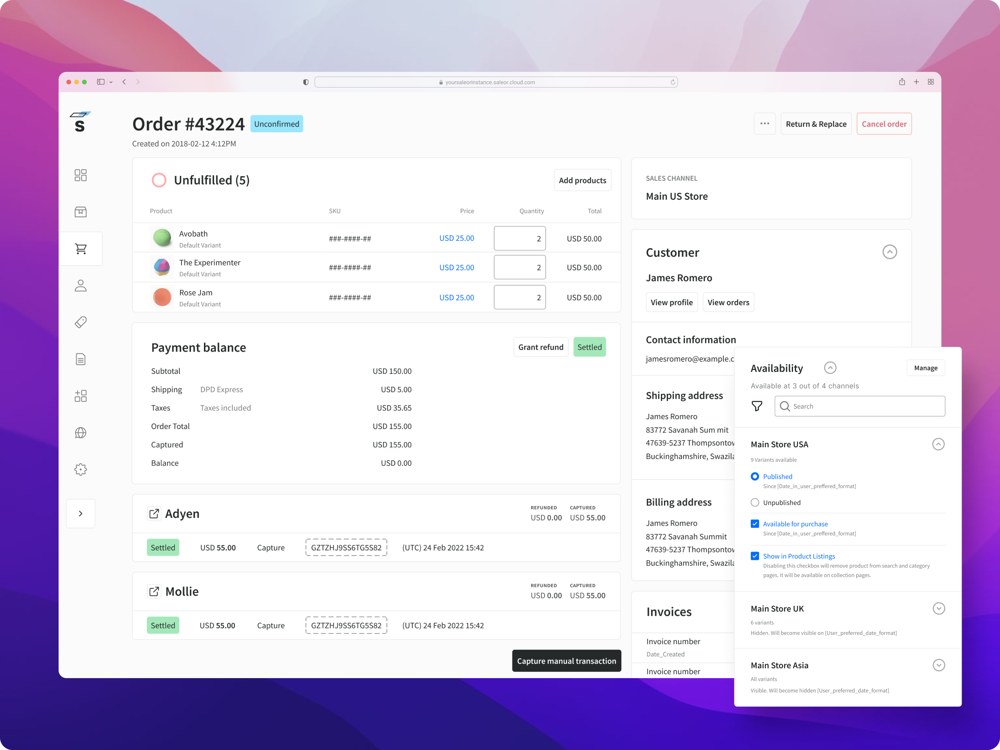

# Saleor CI/CD pipeline

Deploy Saleor with CI/CD on Elestio

 
 

# Once deployed ...

You can open Saleor here:

    https://[CI_CD_DOMAIN]/
    Login: admin
    password: [ADMIN_PASSWORD]

You can open pgAdmin web UI here:

    https://[CI_CD_DOMAIN]:60128/
    Login: [ADMIN_EMAIL]
    password: [ADMIN_PASSWORD]
